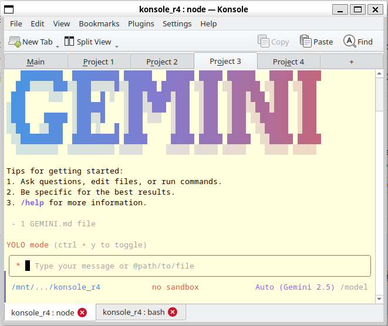

# Konsole with Project Management

A powerful enhancement to KDE's Konsole terminal emulator that adds project-based tab organization with two-level hierarchy.

## Features

### 🎯 Project-Based Tab Organization
- **Two-level tab hierarchy**: Project tabs at the top, shell tabs below
- **Project tabs**: Easily visible and clickable project selector
- **Automatic filtering**: Only show shell tabs belonging to the selected project
- **Project management**: Create, rename, and switch between projects

### 🚀 Smart Navigation
- **Ctrl+PageUp/PageDown**: Navigate through shell tabs within current project
- **Boundary crossing**: Automatically jumps to adjacent project when reaching tab edges
- **Ctrl+1 to Ctrl+9**: Direct project access shortcuts
- **Seamless workflow**: Keyboard-driven project and tab management

### ⚙️ Project Features
- **Auto-create tabs**: First terminal automatically created when new project is created
- **Rename projects**: Right-click or double-click project tabs to rename
- **Project persistence**: Projects maintained for the session
- **Tab filtering**: Only active project's tabs are visible

## Screenshot



Shows multiple projects (Main, Project 1, Project 2, Project 3, Project 4) with shell tabs organized below by project.

## Installation & Build

```bash
# Clone the repository
git clone git@github.com:aamirkhani/konsole_with_project_management.git
cd konsole_with_project_management

# Build
mkdir build && cd build
cmake -DCMAKE_BUILD_TYPE=Release ..
make -j4

# Run
./bin/konsole
```

## Usage

### Creating Projects
1. Click the **"+"** tab at the far right of the project tabs
2. A new project is created with auto-generated name (Project 1, Project 2, etc.)
3. First terminal automatically created in the new project

### Renaming Projects
**Option 1: Right-click menu**
1. Right-click any project tab
2. Select "Rename Project..."
3. Enter new name

**Option 2: Double-click**
1. Double-click any project tab
2. Enter new name directly

### Switching Projects
- **Click** project tabs to switch
- **Ctrl+1** through **Ctrl+9** for direct project access

### Managing Shell Tabs
- **New Tab**: Click "New Tab" button or use terminal shortcuts
- **Next Tab (in project)**: Ctrl+PageDown (stays within project, jumps to next project at boundary)
- **Previous Tab (in project)**: Ctrl+PageUp (stays within project, jumps to previous project at boundary)
- **Close Tab**: Click X button on tab or use terminal shortcuts

## Architecture

### New Components
- **Project.h/cpp**: Core project data model
- **ProjectManager.h/cpp**: Project lifecycle management
- **ProjectHeaderWidget.h/cpp**: Project UI widget
- **ProjectTabBar.h/cpp**: Project tab bar for visual tab switching

### Modified Components
- **ViewContainer.h/cpp**: Terminal-to-project mapping, tab filtering
- **ViewManager.h/cpp**: Project tab bar integration, shortcut setup
- **CMakeLists.txt**: Build configuration for new components

## Keyboard Shortcuts

| Shortcut | Action |
|----------|--------|
| **Ctrl+1 to Ctrl+9** | Switch to projects 1-9 |
| **Ctrl+PageDown** | Next tab in project (or next project) |
| **Ctrl+PageUp** | Previous tab in project (or previous project) |
| Right-click project tab | Rename project |
| Double-click project tab | Rename project |
| Click "+" tab | Create new project |

## Implementation Details

### Tab Filtering
Only shell tabs belonging to the active project are visible. This is accomplished using `QTabBar::setTabVisible()` to dynamically show/hide tabs based on project membership.

### Navigation
The navigation system is project-aware:
- Tab navigation respects project boundaries
- Reaching the edge of a project's tabs automatically switches to the adjacent project
- All navigation is keyboard-friendly

### Project Shortcuts
Alt+1 through Alt+9 map to projects 1-9, providing fast switching for up to 9 projects. The shortcuts are dynamically created based on the number of projects.

## Git Commits

Latest commits implementing this feature:
- `0e45106` - Change project shortcuts from Alt+N to Ctrl+N
- `7af50ae` - Add smart tab navigation and Alt+N project shortcuts
- `52c5665` - Add project-based tab organization to Konsole

## Requirements

- KDE Frameworks 5.71+
- Qt 5.15+
- CMake 3.16+

## License

SPDX-License-Identifier: GPL-2.0-or-later

This is a modified version of KDE Konsole. All modifications follow the same GPL-2.0-or-later license.

## Author

Project management enhancement by Aamer Khani
Based on KDE Konsole 22.12

## Notes

- Projects are session-based (not persistent across restarts)
- Up to 9 projects can be accessed via Ctrl+N shortcuts
- Each project maintains its own set of shell tabs
- Tab filtering is automatic and transparent to the user
